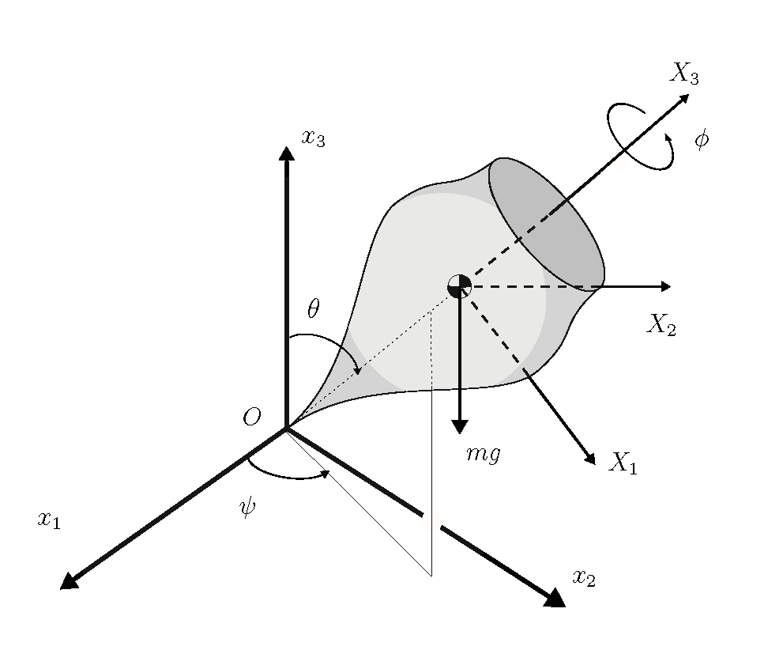

# Introduction to the JuDyn software

The **JuDyn** software is
an environment developed in the **JULIA** language to solve a variety of problems 
of _Flexible multibody Dynamics_.

The main features of **JuDyn** are the following: 
* Is is organized as a series of modules callable from a main script describing a specific application.
* It is based the finite element concept. Rigid bodies and elastic components (e.g. beams, shells), kinematic joints and  even nodal forces are equally treated as finite elements. Theerefore, the system topology is intrinsic to the element connectivity.
* In the treatment of dynamic problems, the motion field (node positions and rotations) and the velocity field (linear and angular velocities) are treated as independent and matched through kinematic compatibility relationships. As a result, the  system equations  of a transient problem are of the first-order in time and thus solved using a first-order integration scheme.
* The system degrees of freedom (dofs) are  of four types: generalized displacements, generalized velocities, Lagrange multipliers associated to constraints and  variables internal to elements.
* The response computation is  always based on an updated incremental solution with Newton-Raphson iteration, the inner linear system being treated as sparse. 
* The velocity degrees of freedom are inherent to elements and therefore do not take part to the element connectivity process. As a result, hey do not take part either to the solution of the linearized system equation but can be eliminiated beforehand.  
* In the dynamic case, the transient response is computed using the first-order version of the generalized-$\alpha$ method. Its stability (in particular in presence of constraints) is controlled by adapting the spectral radius of the integration scheme.
* Static problems involving inequality constraints on the system configuration can also be solved.
* Superelements obtained from the condensation of a large $\textit{\textbf{(K,\, M)}}$ linear model (e.g. as obtained from a 3D solid finite element model) can be integrated in the system through the Floating Frame of Reference (FFR) method. The FFR implementation in **JuDyn** is base on a decomposition into rigid  body modes, attachment modes and free-free vibration modes.
* The global frame of reference of the model can be assumed non-inertial, but rotating at constant angular velocity with respect to an inertial frame. This feature allows the efficient treatment of problems of rotor dynamics.
* Postprocessing is generally problem-specific. Therefore the responsibility of developing it is left to the user.

## General organization

**JuDyn** consists  in a series of **Julia** modules callable by an application-dependent main script that describes the current application and controls the successive steps 
of its treatment, namely  model generation, system solution and postprocessing.  The general organization of the **JuDyn** software is described in Figure 1. The modules controlling 
the flow of the application process are highlighted in grey. 
The role of the different modules is briefly outlined hereafter.


*Figure 1. the JuDyn sofware*


### JuDyn module

The role of the **JuDyn** module is to include all the relevant modules of the control flow (in grey on Figure 1) and the auxiliary modules (in white) requested in a single module.

### FORDYN module

The role of the **FORDYN** module  is to create the *Main.model\_container* data container  that collects the general data describing the application and controlling the solution process. 

    
### Nodes module

The **Nodes** module creates the *'Main.model\_container'* data container collecting the initial node coordinates and orientations. Its *'set\_node(...)'*  function allows defining diffferent sets of nodes ("frame", "3D", "linked") and entering their geometrical data.

### SetElements module

The **SetElements** module creates the *'Main.element\_container'*  data container that collects 
the list of elements with their type and connectivity.
It provides  a series of *'set\_XXX(...)'*  functions  that allow defining structural elements (e.g.*'set\_beam(...)'*), their connectivity (e.g. *'set\_hinge(...)'*)   
and also the loading on the system (e.g. *'set\_node_force(...)'*). The first occurence of each element type provokes the opening of a type-specific data container named  *'Main.SetElements.xxx\_container'*  (e.g. *'Main.SetElements.beam\_container'*)  that collects all element data required during the solution process by the **BuildElements** module.  

### AssembleSparse module

The **AssembleSparse** module is a preprocessor for the subsequent creation of a sparse array data structure  by the **Solve** module. The degrees of freedom (dofs) of the system are classified as kinematic (I.e. positions and roations) dofs, Lagrange multipliers, internal dofs (e.g. hinge rotations)  and velocities. It function *'assemble(...)'* numbers the dofs and orders them in separate lists, collects them in a structural localization vector and constructs an inverse form of the latter in order to localize each dof of each element into the global system of equations.

### BoundaryConditions module

As its name indicates, the **BoundaryConditions** module allows prescribing boundary conditions at nodes of the model.

### InitialConditions module

The **InitialConditions** module is invoked only in the case of either dynamic problems,  or quasi-static problems such as viscoelastic response. Most generally, initial conditions can be precsribed on nodal positions and rotations and associated velocities. In specific cases, the initial configuration can be set as the final configuration of a previous analysis. 
  
### Solve module

The **Solve** module allows different types of solutions.  The *'sol\_type'*   parameter of the *'solve(...)'*  function allows switching between different solvers by taking the following values: "dynamic","static" or "static_constrained". In any case, the response computation is  based on an updated incremental solution with Newton-Raphson iteration, the inner linear system being treated as sparse.
* "dynamic": the transient time response is computed using the generalized-$\alpha$ method.
* "static": the static nonlinear response is computed step-by-step using a pseudo-time parameter.
* "static_constained": the static nonlinear response is computed step-by-step using a pseudo-time parameter, with inequality constraints imposed on the displacement solution.

Whatever be the *'sol\_type'*, the module **Solve** allows optionally to compute the eigenspectrum of the tangent system at specified time steps.

The results of the module **Solve** are archived at a specified frequency in a file of *'.h5'* type.

### BuildElements module

The  elements building functions (e.g. _beam(...)_, _rigid_body(...)_) of the **BuildElements** module are called iteratively by the module **Solve** to compute the contribution of each element in the system to the golbal residual vector and iteration matrix.


### Frame module

At the beginning of the solution process, the *'init\_frames(...)'*  function of the **Frame** module is called by the module **Solve** to create the *'Main.Frame.current\_frames'*  data structure. The latter is then updated at the end of each time increment by the *'increment\_frames(...)'*  function with the current system configuration.

### MyAlgebra module

**MyAlgebra**  is a module  introducing different user types to describe _S03_ and _SE3_ entities and providing functions to perform associated operations. 

The user types are:

* _Vec3(...)_ :  vector with 3 components allowing to represent  geometric entities such as position, velocity, set of Euler angles.
* _Mat3(...)_ :   3 x 3 matrix (e.g. rotation and tangent operators).
* _RV3(...)_ :  rotation vector $\textit{\textbf{n}}\phi$ describing a frame orientation  $\textit{\textbf{R}}$ in _SO3_.
* _Quat(...)_ : quaternion $[q_0 \;  q_1 \; q_2 \; q_3]$ describing a frame orientation $\textit{\textbf{R}}$ in _SO3_.
* _NodeFrame(...)_ :  compound structural type  describing a nodal frame,  with translation and rotation parts   $\textit{\textbf{(x,\, R)}}$.

Examples of operations described by associated functions are:

* _c = RV3(a::RV3,b::RV3)_ : composition  of two successive  rotations generating a rotation vector _c::RV3_.
* _R = rot(a::RV3)_ : construction of the rotation operator R::Mat3 associated to the rotation vector _a::RV3_.
* _T = tang(a::RV3)_ : construction of the tangent operator T::Mat3 associated to the rotation vector _a::RV3_.

### Superelements module

**Superelements** is a module allowing to include in the global model superelements using the floating frame of reference approach. The  stiffness and mass matrices of the linear model from which the superelement is constructed have to be provided externally. In the specific case of linear beam models, they can be contructed using the **LinearBeam** module. 

### LinearBeam module

The **LinearBeam** module allows assembling linear beam models which can be used for later use as superelements. It also allows to construct the linear kernel of the _'super_beam'_ element.

### Utils module

**Utils** is an auxiliary module providing a large variety of functions to access and munipulate the data of the model and postprocess the results.

### Externnal modules

A number of external modules are also used in the control flow of a **JuDyn** application and we be called during the **JuDyn** precompiling phase. In particular, 

* for linear algebra and matrix handling: **LinearAlgebra**,  **SparseArrays**, **Arpack**;
* for file manipulation: **JSON**, **JLD**, **HDF5**.
* for graphics: **Plots**, **GeometryBasics**, **GLMakie**, **CairoMakie**,
* for solving constrained systms: **JuMP**, **IpOpt**, **DataFrames**,
* for time measurement: **Dates**.


The simple example of **JuDyn** script below allows computing the center of mass trajectory of a top rotating in a gravity flow (Figure 2). It shows how the sript for the solution of a specific problem is organized using the **JuDyn** series of modules.



*Figure 2. top kinematics.*


````{verbatim}
    using JuDyn
    # ===================================================================
    # opening of model structure with the creation of the model_container,
    # node_container and element_container arrays
    # ===================================================================
    model_container, node_container, element_container = create_model()
    # ===================================================================
    # introduction og general model data 
    # ===================================================================
    gravity = Vec3(0.,0.,-9.81)
    name = "top_with_frame_link"
    update = true
    set_general_data(name,gravity,update)
    # ===================================================================
    # frame orientation (rotation vector)  computed from Euler angles.
    # ===================================================================
    psi = 0.0
    theta = pi/9.0
    phi = 0.0
    Rot2 = euler_to_RV(phi,theta,psi)
    # ========================================================================
    # initial material angular velocity computed  from Euler angle derivatives.
    # ========================================================================
    phidot = 50.0
    psidot = -10.0
    thetadot = 0.0
    axe1 = Vec3(1.0,0.0,0.0)
    axe3 = Vec3(0.0,0.0,1.0)
    # ============
    # node input
    # ============
    X_2 = Vec3(0.,0.,1.3)
    x_1 = Vec3()
    x_2 = rot(Rot2,X_2)
    Rot1 = RV3()
    set_node(10,x_1,Rot1,"frame")
    set_node(20,x_2,Rot2,"frame")
    # ====================
    # closing node input
    # ====================
    end_nodes()
    # ================
    # element input
    # ================
    mass = 5.0
    inertia = Vec3(0.8,0.8,1.8)
    set_rigid_body(1,20,mass,inertia)
    set_frame_link(2,10,20)
    # ======================
    # end of element input
    # ======================
    end_elements()
    # ========================
    # set boundary conditions
    # ========================
    set_node_BC(10,"pinned")
    end_BC()
    # ================
    # model assembly
    # ================
    sol_type = "dynamic"
    assemble(sol_type)
    # =============================
    # eventually, print model data
    # =============================
    print_model(model_container)
    # =============================
    # initial conditions input
    # =============================
    Omega=axe3*phidot+rot(-phi,3)*(axe1*thetadot+rot(-theta,1)*axe3*psidot)
    v_2=rot(Rot2,crossp(Omega,X_2))
    println(v_2,Omega)
    initial_conditions()
    set_initial_velocity(20,v_2,Omega)
    end_initial_conditions()
    # =====================================================================
    # response computation : dynamic response is using generalized-α is the 
    # standard. Solution parameters are read from JSON_file.
    # ======================================================================
    input_dir = "test/Examples/top/input_files/"
    JSON_file = input_dir*"top.json"
    h5_file = solve(JSON_file,sol_type)
    # ======================================================================
    # Archiving of model data and solution results for post-processing by 
    # "postpro_top.jl"
    # ======================================================================
    output_dir = "test/Examples/top/output_files/"
    jld_file = save_topology(output_dir*name)
    h5_file = save_results(h5_file,output_dir*name)
````

Postprocessing is done in a separate script (*'examples/top/postpro_top.jl'*) 
reading the *'top_with_frame_link.h5'* and *'top_with_frame_link.jld'* output files. Figure 3 displays the computed  trajectory of the to center of mass. 


*Figure 3. Trajectory of the top center of mass.*